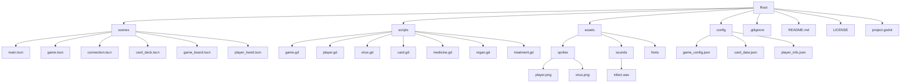
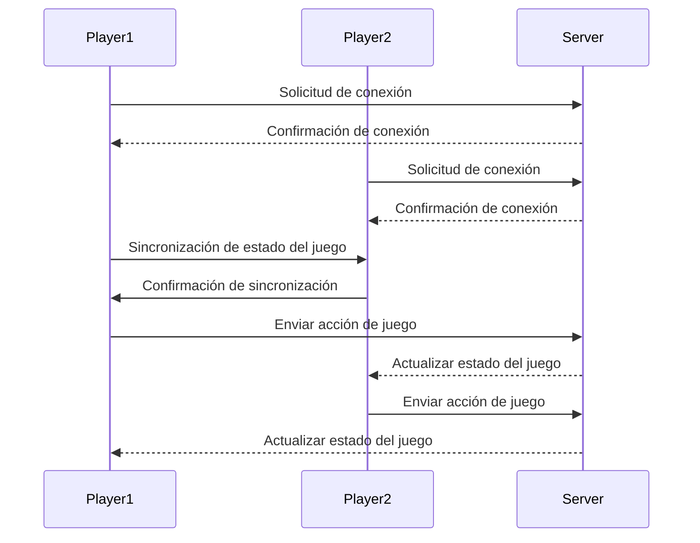

# Virus-Game

Este proyecto es un juego peer-to-peer desarrollado con Godot Engine. A continuación, se detalla la estructura del proyecto y la función de cada sección y archivo.

## Estructura del Proyecto

## Explicación de la Estructura

### scenes
Contiene todas las escenas del juego. Cada escena es un archivo `.tscn` que define la jerarquía de nodos y sus propiedades.
- **main.tscn:** Escena principal del juego, que incluye el menú y el lobby.
- **game.tscn:** Escena del tablero de juego.
- **connection.tscn:** Escena de conexión para el modo peer-to-peer.
- **card_deck.tscn:** Escena que representa el mazo de cartas.
- **game_board.tscn:** Escena que representa el tablero de juego.
- **player_hand.tscn:** Escena que representa la mano del jugador.

### scripts
Aquí se almacenan todos los scripts de Godot, escritos en GDScript. Cada script se asocia a un nodo y define su comportamiento.
- **gameboard.gd:** Lógica principal del juego.
- **player.gd:** Comportamiento del jugador.
- **virus.gd:** Comportamiento del virus.
- **card.gd:** Lógica de las cartas.
- **medicine.gd:** Lógica de las medicinas.
- **organ.gd:** Lógica de los órganos.
- **treatment.gd:** Lógica de los tratamientos.

### assets
Contiene todos los recursos del juego, como imágenes, sonidos, fuentes, etc. Organízalos en subcarpetas para mantener una mejor estructura.
- **sprites:** Imágenes utilizadas en el juego.
  - **player.png:** Imagen del jugador.
  - **virus.png:** Imagen del virus.
- **sounds:** Archivos de sonido utilizados en el juego.
  - **infect.wav:** Sonido de infección.
- **fonts:** Fuentes utilizadas en el juego.

### config
Almacena archivos de configuración del juego, como el tamaño del tablero, las opciones de juego, etc.
- **game_config.json:** Configuración general del juego.
- **card_data.json:** Datos de las cartas.
- **player_info.json:** Información de los jugadores.

### .gitignore
Este archivo ignora los archivos que no deseas incluir en tu control de versiones (e.g., archivos temporales, caché).

### README.md
Este archivo proporciona información sobre el proyecto, su estructura y cómo configurarlo.

### LICENSE
Este archivo contiene la licencia del proyecto.

### project.godot
Archivo de configuración del proyecto de Godot.

## Flujo de Datos

Este flujo de datos muestra cómo los jugadores se conectan al servidor, sincronizan el estado del juego y envían acciones de juego entre sí a través del servidor.
